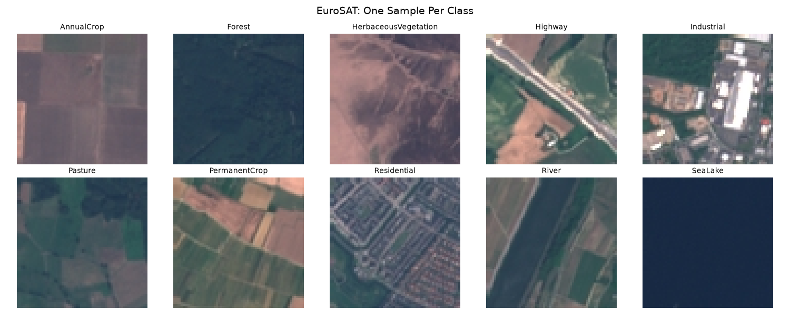
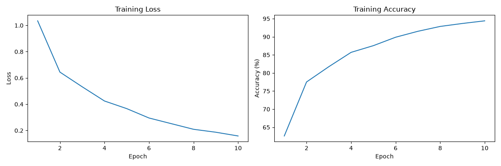
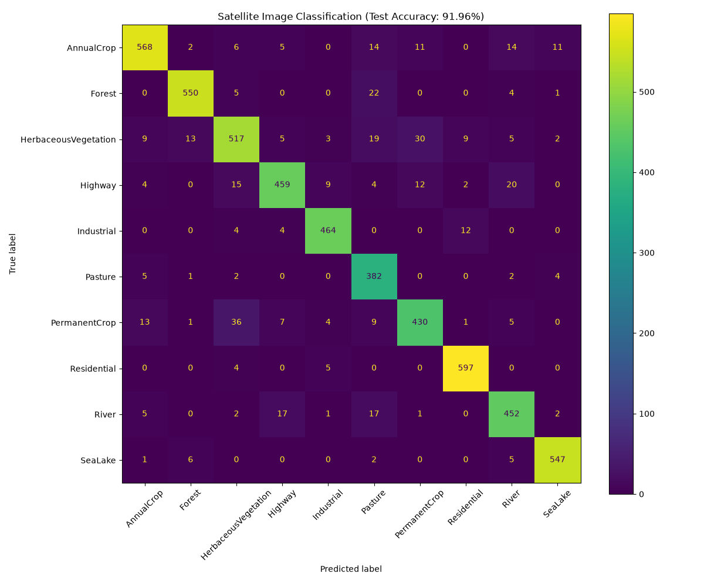

# Satellite Land-Use Classification (EuroSAT)

Land-cover classification on Sentinel-2 satellite imagery, built two ways: a CNN designed and trained from scratch, and a frozen-backbone ResNet18 baseline — both scored on an identical seeded train/test split so the comparison actually means something.

**Custom CNN: 91.96% test accuracy** on a held-out 5,400-image split, trained in 10 epochs. The frozen ResNet18 baseline is implemented and trained; its held-out result is pending a clean re-run — see [Transfer learning comparison](#transfer-learning-comparison).

*Setup: 27,000 images, 80/20 split at seed 42, Adam `lr=1e-3`, single laptop GPU (RTX 3050).*



---

## The dataset

[EuroSAT](https://github.com/phelber/EuroSAT) — 27,000 labeled 64×64 RGB patches from Sentinel-2, covering 10 land-use classes:

`AnnualCrop` · `Forest` · `HerbaceousVegetation` · `Highway` · `Industrial` · `Pasture` · `PermanentCrop` · `Residential` · `River` · `SeaLake`

A few properties of this data drove design decisions downstream:

- **Small inputs (64×64).** Enough spatial resolution for texture and layout cues, not enough for fine object detail. This caps how deep a from-scratch network can usefully go — each `MaxPool2d(2,2)` halves the feature map, so three pooling stages take 64→32→16→8, and a fourth would leave a 4×4 map with little spatial signal left.
- **Balanced-ish classes** (2,000–3,000 per class), so plain accuracy is a defensible headline metric here. On an imbalanced set it wouldn't be, and per-class recall would have to lead instead.
- **Semantically overlapping classes.** `AnnualCrop` / `PermanentCrop` / `HerbaceousVegetation` / `Pasture` are all "green vegetation from above" and differ mainly by field geometry and texture regularity. I expected these to be where errors concentrate; per-class accuracy came out lowest on exactly that group.

Loaded via `torchvision.datasets.EuroSAT`, which handles download and the class-directory structure.

## Preprocessing (custom CNN)

The ResNet18 branch uses its own transform — see [Transfer learning comparison](#transfer-learning-comparison).

```python
transforms.Compose([
    transforms.Resize((64, 64)),
    transforms.ToTensor(),
    transforms.Normalize(mean=[0.485, 0.456, 0.406],
                         std=[0.229, 0.224, 0.225]),
])
```

`ToTensor()` converts HWC uint8 `[0,255]` → CHW float `[0,1]`. `Normalize` then centers each channel to roughly zero mean and unit variance — standard practice to keep inputs in the range where activations and gradients stay well-scaled.

The mean/std values are ImageNet's. That is the correct choice for the ResNet18 branch — the pretrained weights were fit under exactly that input distribution, and feeding differently-scaled inputs would silently degrade every frozen filter. For the from-scratch CNN it's a defensible convention rather than a necessity, since that network learns its filters under whatever normalization it's given. Computing EuroSAT's own channel statistics is the cleaner move for the custom model and is listed under [Known limitations](#known-limitations).

**Split:** 80/20 train/test (21,600 / 5,400) via `random_split` with `torch.Generator().manual_seed(42)`, so the split is identical across the notebook and `transfer_learn.py` — otherwise the two models would be scored on different test sets and the comparison would be meaningless.

## Architecture (from scratch)

```
Input 3×64×64
├─ Conv2d(3→32,  3×3, pad=1) → ReLU → MaxPool(2)   →  32×32×32
├─ Conv2d(32→64, 3×3, pad=1) → ReLU → MaxPool(2)   →  64×16×16
└─ Conv2d(64→128,3×3, pad=1) → ReLU → MaxPool(2)   → 128×8×8
Flatten (8192)
├─ Linear(8192→256) → ReLU → Dropout(0.5)
└─ Linear(256→10)                                  → 10 logits
```

The reasoning behind each choice:

- **3×3 kernels with `padding=1`** preserve spatial dimensions through the convolution, so downsampling happens only at pooling layers — one thing changing size at a time, which makes shape arithmetic tractable.
- **Widening 32→64→128** as spatial size shrinks is the standard information-preserving tradeoff: as you discard *where*, you add capacity for *what*.
- **Dropout(0.5)** sits on the 8192→256 layer because that layer holds ~2.1M of the model's ~2.2M parameters — it's where overfitting would originate, so that's where the regularizer goes.
- **No softmax on the output.** `nn.CrossEntropyLoss` applies `log_softmax` internally, so it expects logits. Adding an explicit softmax would feed already-normalized probabilities into it, distorting the loss surface and flattening gradients. The model emits raw logits by design.

Shapes were verified with a dummy forward pass (`torch.randn(64,3,64,64)` → `[64,10]`) before training, which catches flatten-dimension mistakes in seconds instead of at epoch 1.

**Training:** Adam (`lr=1e-3`), cross-entropy, batch size 64, 10 epochs, CUDA.

## Results

Test accuracy: **91.96%** (5,400 held-out images).

| Class | Accuracy | | Class | Accuracy |
|---|---|---|---|---|
| Residential | 98.5% | | River | 90.9% |
| SeaLake | 97.5% | | AnnualCrop | 90.0% |
| Pasture | 96.5% | | Highway | 87.4% |
| Industrial | 95.9% | | PermanentCrop | 85.0% |
| Forest | 94.5% | | HerbaceousVegetation | 84.5% |




**Reading the results.** The accuracy spread is not noise — it tracks class separability. The four strongest classes (`Residential`, `SeaLake`, `Industrial`, `Forest`) have distinctive global texture: dense regular grids, flat uniform color, large bright rooftops, dense uniform canopy. The four weakest are the vegetation cluster, which is exactly the failure mode predicted from the class definitions: `HerbaceousVegetation` (84.5%) and `PermanentCrop` (85.0%) differ from their neighbors by field-boundary regularity, a cue that survives poorly at 64×64.

`Highway` (87.4%) fails differently — it's a thin linear structure occupying a small fraction of a patch that is otherwise whatever land surrounds it, so the label depends on a minority of pixels. `River` (90.9%) has the same thin-linear-feature problem but a stronger color prior.

The gap between final training accuracy (94.40%) and test accuracy (91.96%) is ~2.4 points — mild overfitting, consistent with dropout doing its job but with no data augmentation in play.

## Transfer learning comparison

`transfer_learn.py` runs the second branch: ImageNet-pretrained ResNet18, entire backbone frozen (`requires_grad=False`), final FC replaced with `Linear(512→10)`, and only that new layer trained — the optimizer is given `resnet.fc.parameters()` only, so the pretrained features are used strictly as a fixed extractor.

Inputs are resized 64→224 to match ResNet's expected receptive-field scale. This doesn't add information; it puts the existing information at the spatial scale the pretrained filters were tuned for. It also makes this branch far more expensive per image — ~12× the pixels — so the two branches trade compute against trainable capacity in opposite directions: 5 epochs training one layer on large inputs vs. 10 epochs training everything on small ones.

| Model | Input | Trainable params | Epochs | Train acc | Test acc |
|---|---|---|---|---|---|
| SatelliteCNN (from scratch) | 64×64 | ~2.2M (all) | 10 | 94.40% | 91.96% |
| ResNet18 (frozen backbone) | 224×224 | 5,130 (final FC only) | 5 | 91.22% | 93.26% |

Both models are scored on the same 5,400-image test split (seed 42).

**The result so far:** the frozen backbone reached 92.22% training accuracy in 5 epochs against the scratch model's 94.40% in 10. The held-out comparison is the number that matters and is pending a clean re-run.

ImageNet features are learned from ground-level object photographs. EuroSAT is nadir-view land cover: no canonical orientation, no figure/ground structure, no object-part hierarchy. Low-level ImageNet filters (edges, color opponency, texture statistics) transfer fine — they're close to generic. The high-level object-part detectors that make ResNet powerful on natural images have much less to say about a wheat field. Freezing the backbone tests exactly that boundary, and the flat result says the transferable signal here is mostly the low-level half.

Two details make the near-tie more interesting than the headline number:

- **Parameter efficiency.** ResNet18 reached it by fitting 5,130 parameters — three orders of magnitude fewer than the scratch model, in half the epochs. As a "how far does a linear probe on generic features get you" baseline, that is a strong showing.
- **Expected generalization behavior.** With only a linear layer trainable, the frozen model has very little capacity to memorize the training set, so its train/test gap should come in well under the scratch CNN's 2.4 points. Worth confirming once the test number is in.

The obvious next experiment is unfreezing `layer4` at a low learning rate (~1e-4). If the domain-gap reading above is right, the gains should come from re-fitting the high-level blocks while the early filters stay put.

## Repo layout

```
satellite_classifier.ipynb   # main workflow: EDA → model → training → evaluation → confusion matrix
transfer_learn.py            # ResNet18 frozen-backbone baseline on the identical split
verify_setup.py              # CUDA/environment sanity check
eurosat_samples.png          # one sample per class
training_curves.png          # loss and accuracy per epoch
confusion_matrix.png         # 10×10 test-set confusion matrix
```

## Running it

```bash
python -m venv .venv && .venv\Scripts\activate      # Windows
pip install -r requirements.txt
python verify_setup.py                              # confirm CUDA is visible
jupyter notebook satellite_classifier.ipynb         # main workflow
python transfer_learn.py                            # ResNet18 baseline
```

The dataset (~90 MB) downloads automatically on first run into `data/` (gitignored). PyTorch is pinned to the CUDA 12.6 build; on a CPU-only machine install stock `torch` instead — everything still runs, just slowly.

**Environment:** Python 3.13 · PyTorch 2.13 (CUDA 12.6) · torchvision 0.28 · scikit-learn 1.9 · matplotlib 3.11 · NVIDIA RTX 3050 6GB

## Known limitations

Being explicit about what this project does *not* do:

- **No validation split.** Architecture and epoch count were fixed up front rather than selected on held-out data. That keeps the test number honest for a single run, but any real tuning needs a proper 70/15/15 split — this is the first thing I'd change.
- **No data augmentation.** Overhead imagery has no canonical orientation, so random flips and 90° rotations are essentially free label-preserving augmentations — an unusually good fit here. Untested, but the obvious first experiment against the 2.4-point train/test gap.
- **ImageNet normalization statistics** applied to the custom CNN, where EuroSAT's own channel means/stds would be more principled. Correct for the ResNet branch; a convention rather than a justified choice for the scratch model.
- **RGB only.** EuroSAT also ships a 13-band multispectral version. The RGB subset discards near-infrared, a strong signal for separating vegetation types — precisely the classes that underperform here. Worth testing, not tested.
- **No LR schedule, no fine-tuning of ResNet's upper blocks, no checkpointing.** Weights aren't persisted, so evaluation must follow training in the same session.
